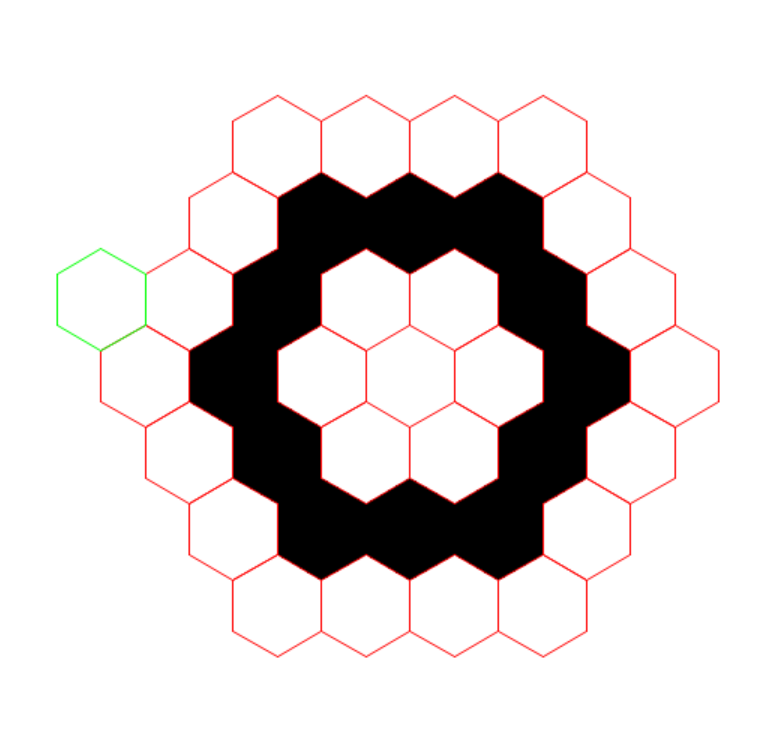
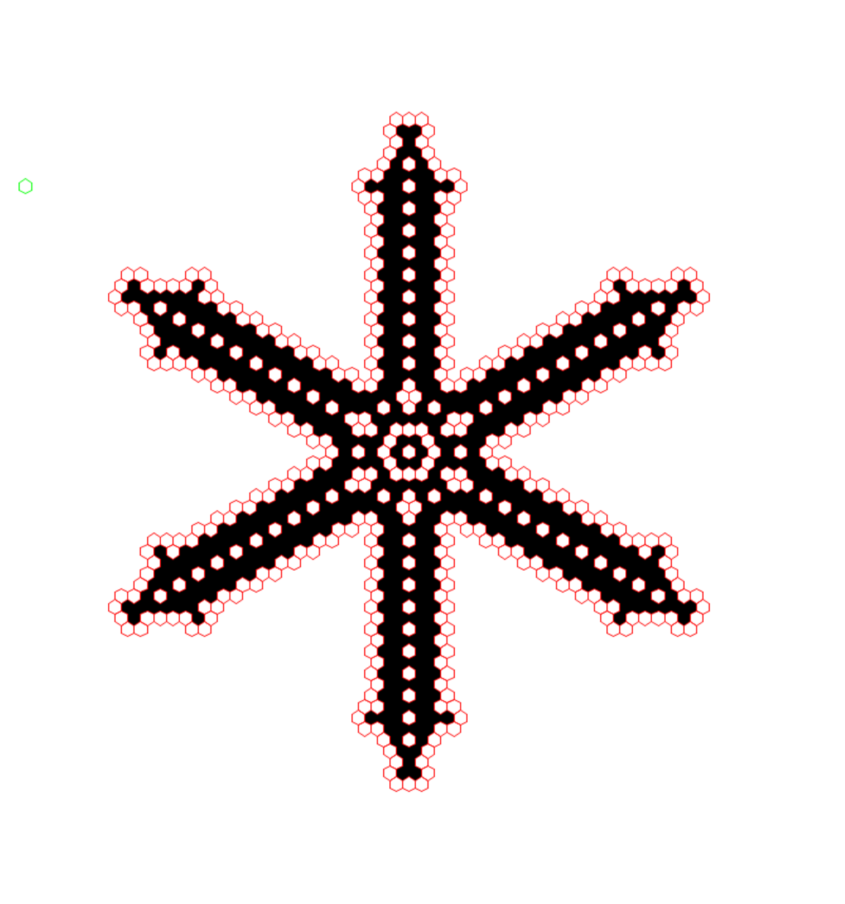

# Hexagonal Game of Life

We adapted Conway's game of life by replacing squares by hexagons.

    Rules :
    - If a tile has 6 neigbours or more, it dies in the next generation.
    - If a tile has between 3 and 5 neighbours, it survives in the next generation.
    - If a tile has exaclty 2 neighbours, and is currently dead, it births in the next generation.

    Controls :
    - Left click : drag the map.
    - Right click : place a tile.
    - Middle click : remove a tile.
    - Scroll wheel : zoom in/out.

## Interesting shapes

Doing :

 

Will turn into:

## Credits

    Programmers :
    - Théophile "fkS124" Aumont
    - Nicolas "OZHER" Malet
 